# スクロールシューティングゲーム（純粋なJavaScript製）
# 網頁卷軸射擊遊戲 (純 JavaScript 製作)
# Side-Scrolling Shooting Game (Pure JavaScript)

2D shooting game Action game Platformer

## ゲーム画面プレビュー | 遊戲畫面預覽 | Game Screen Preview

画像プレビュー：| 影像預覽 | Image Preview
 
<table>
  <tr>
    <td align="center">
      ゲーム画面 /遊戲畫面 / Gameplay screen 
      
    </td>  
  </tr>
</table>
 

 
<table>
  <tr>
    <td align="center">
      今回の挑戦者 / 本次的挑戰者 / This time's challenger 
      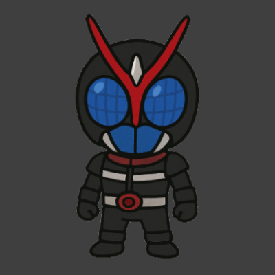
    </td>
    <td align="center">
      ボス-エアーマン / 王-空氣人 / BOSS-Air Man 
      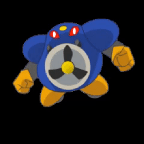
    </td>
  </tr>
</table>
 

 
<table>
  <tr>
    <td align="center">
      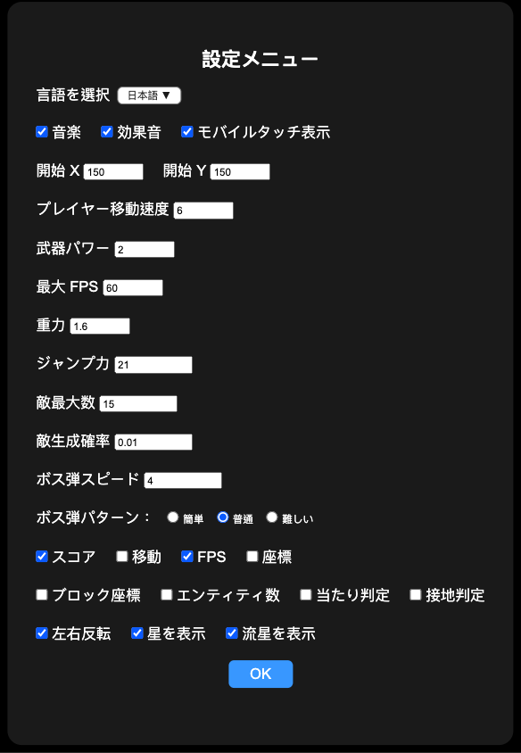
    </td>
    <td align="center">
      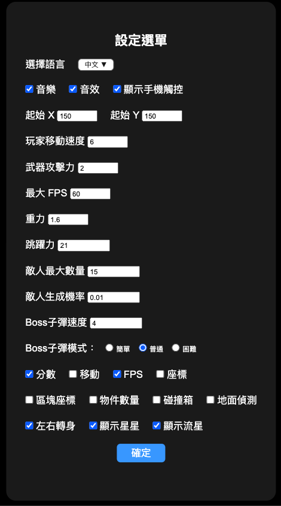
    </td>
    <td align="center">
      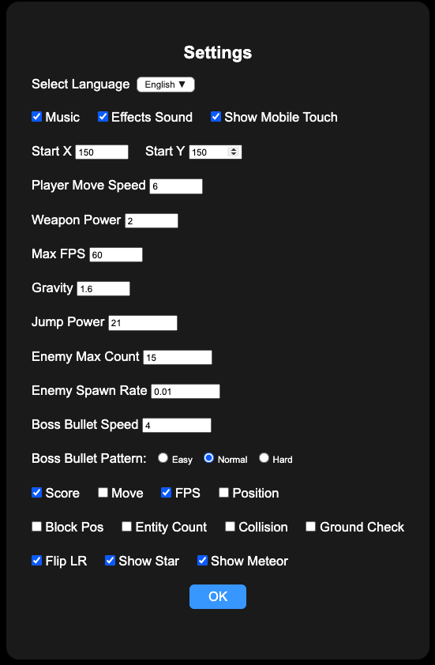
    </td>
  </tr>
</table>
 

 

## 図層機能テスト | 圖層功能測試 | Layer Feature Testing

 
 
接地判定(距離の調整テスト) | 地面碰撞箱(距離調整測試) | Ground Collision (Distance Offset Test)
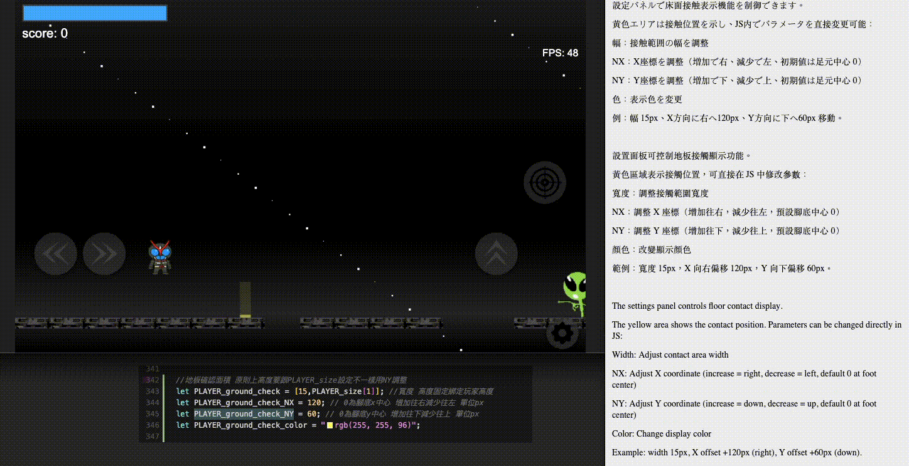
 
 

接地判定(幅調整テスト) | 地面碰撞箱(寬度調整測試) | Ground Collision (Horizontal Size Test)
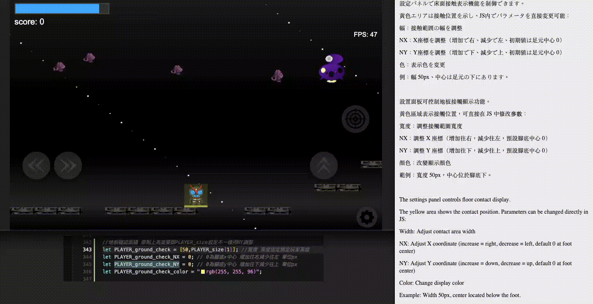
 
 

ハートボックス (範囲テスト) | 受擊碰撞箱（範圍測試）| Hurtbox Collider (Range Test) 
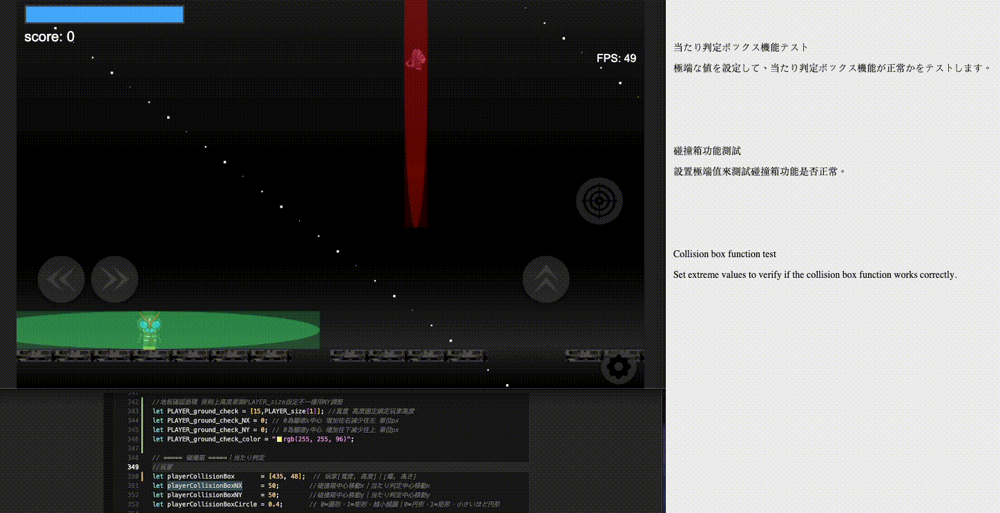
 
 

背景の流星エフェクトテスト | 背景流星雨效果測試 | Meteor Shower Background Effect Test
 
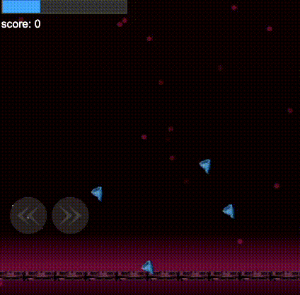
 
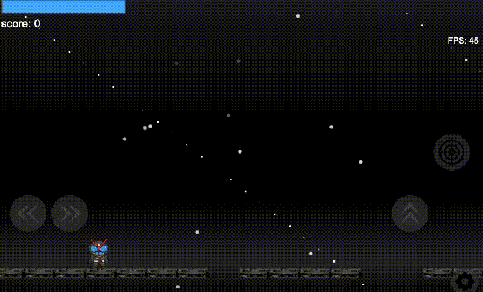
 
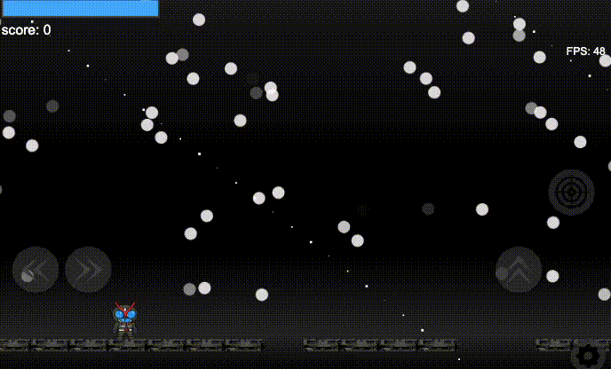

 

## ゲーム動画プレビュー | 遊戲影片預覽 | Gameplay Video Preview：  
[こちらをクリックして視聴](https://drive.google.com/file/d/1upNH9sbyREraia6M8-w-IAxr0UHxLgVn/view?usp=drive_link)

🌐 試遊 (一部スマホ対応) | 試玩（部分手機支援） | Playable Demo (Partially Mobile Compatible)：  
[こちらをクリックしてプレイ](https://watoki-webgame-famicom-rockman.web.app)

# スクロールシューティングゲーム（純粋なJavaScript製）

本プロジェクトは、私が最も好きなクラシックゲーム「ロックマン」に
インスパイアされた、**純粋なJavaScript**で
開発したスクロールシューティングゲームです。

## 特徴

- **多言語対応**  
  中国語、日本語、英語の3言語に対応しています。

- **クロスデバイス対応**  
  **画面コントロールタッチボタン**（表示・非表示可能）を自作し、スマホブラウザ・PCブラウザの両方で快適にプレイできます。

- **ゲームパラメータの調整可能**  
  設定メニューから、プレイヤーの攻撃力やボスの行動パターンなど、さまざまなパラメータを自由に調整できます。

- **デバッグ表示機能**  
  コリジョンボックス、地面検知、座標、FPSなどの情報を表示可能です。

- **背景隕石システム**  
  背景にランダム生成される隕石、パラメータ設定は90行目に統一管理しています。

- **コード整理**
  - キャラクターと関連設定：1〜81行目、および333〜404行目
  - 背景と地面設定：89〜252行目
  - （一部設定は未完成です。例：`let enemyMaxCount` など。動作しない場合はご容赦ください 😂）

- **テンプレート参照**  
  初期にDeepSeek AIで生成したテンプレートは `deepseek.html` に置いてあります。

## 開発の感想

最初は「AIだけで完全なゲームを作れるか？」という期待を抱き、大胆にもロックマンの完全版を生成させようとしました。  
しかし――奇跡は起きませんでした（笑）。

そこで徐々に目標を下げ、最終的に約600行のスクロールゲームの原型を手に入れました。  
2年前の自分だったら、これだけの量を得るために何度もAIに質問しなければならなかったでしょう。

最初はAIだけに任せて進めましたが、約1500行生成された時点で結果が理想とは違い、もっと早く人力で介入すべきだったと後悔しました。  
それでも今回の練習で多くの収穫がありました。例えば：
- ジャンプ機能をすぐ見つけて設置してくれる（ただし、設置ミスも多い 😅）
- 関数検索や実装設計にかかる時間を大幅に短縮できたこと

## 開発中の反省点

### 音声遅延問題

開発3日目にスマホブラウザでプレイテストした際、音声に遅延が発生していることに気づきました。  
その後、Web Audio APIを使って解決しましたが、Web Audio APIはローカルHTTPサーバー（例：`node.js` の `http-server`）経由でないと動作しません。  
ユーザーの手間を考慮して、最終的にはWeb Audio APIを削除しましたが、今考えると削除すべきではなかったと後悔しています…（涙）。

### 主人公画像のサイズ調整

もともとテクスチャ貼り付けのテストが目的だったため、主人公画像の幅をあまり気にしていませんでした。  
主にコリジョンボックス、地面検知、キャラクターのテクスチャレイヤー分離に集中していました。  
画像サイズの調整は簡単にできたはずですが、時間とリソースの制約から（PowerPointで簡易的に編集したため 😂）、結局最後まで修正できませんでした。

## お問い合わせ

本プロジェクトに関してご意見・ご感想などありましたら、ぜひご連絡ください！

📩 ryuuwatoki@gmail.com

# 網頁卷軸射擊遊戲 (純 JavaScript 製作)

本專案是一款使用**純 JavaScript**開發的卷軸射擊遊戲，靈感來自我最喜歡的經典遊戲「洛克人」。

## 特色

- **多語言支援**  
  支援中文、日文、英文三種語言。

- **跨裝置操作**  
  自行開發了**螢幕控制觸碰按鈕**（可顯示與隱藏），讓手機瀏覽器與電腦瀏覽器都能順利操作。

- **可調整的遊戲參數**  
  透過設定選單，使用者可以調整包括玩家攻擊力、Boss 行為模式等多項參數。

- **除錯輔助顯示**  
  可開啟碰撞箱、地面偵測、座標、FPS 等除錯用顯示資訊。

- **背景隕石系統**  
  隨機生成隕石，相關參數統一管理於第 90 行。

- **程式碼區塊整理**
  - 角色與相關設定：第 1–81 行 和 第 333–404 行。
  - 背景與地板設定：第 89–252 行。
  - （有些設定未完善，例如 `let enemyMaxCount`，若出現異常請忽略 😂）

- **範例模板**  
  初期使用 DeepSeek AI 生成的模板，參考於 `deepseek.html`。

## 開發心得

起初我抱著「AI 是否能一次寫出完整遊戲」的期待，大膽地請求 AI 生成整套「洛克人」。  
結果——奇蹟並未發生（笑）。

於是我逐漸降低標準，最後得到了一個約 600 行的卷軸遊戲雛形。  
如果是兩年前的自己，大概得問 AI 無數次才能累積出這樣的量。

一開始嘗試不介入、僅靠 AI 一步步生成，大約生成到 1500 行時雖然進行順利，但成果並不理想，後悔沒有早點人力介入。不過這次練習也收穫良多，例如：
- AI 幫我快速找到並安裝人物跳躍功能的函式（雖然函式裝錯的機率不低 😅）。
- 節省了大量搜尋函式、思考實作細節的時間。

## 開發過程中的反省

### 音訊延遲問題

開發第三天在手機瀏覽器上測試時，才發現音效存在延遲問題。  
後來嘗試使用 Web Audio API 成功解決，但使用 Web Audio API 必須透過本機 HTTP 伺服器運行（如使用 `node.js` 開啟 `http-server`）。  
考量使用者門檻後，我刪除了 Web Audio API。但現在回想起來，覺得不應該刪除...（淚目）。

### 主角圖像處理

一開始只是為了測試貼皮效果，沒有特別注意主角圖片寬度問題。  
當時重心放在碰撞箱、地面偵測與角色貼皮圖層的分離。  
雖然圖片調整其實很容易解決，但因為時間有限，加上沒有專業的繪圖軟體資源（只用 PowerPoint 簡單修圖 😂），最後就沒有修改。

## 聯絡方式

如果對本專案有任何建議或想法，歡迎聯繫我！

📩 ryuuwatoki@gmail.com

# Side-Scrolling Shooting Game (Pure JavaScript)

This project is a side-scrolling shooting game developed with **pure JavaScript**, inspired by my favorite classic game, **Mega Man**.

## Features

- **Multi-language support**  
  Supports Chinese, Japanese, and English.

- **Cross-device compatibility**  
  A **custom touch button** (show/hide toggle) was developed, allowing smooth gameplay on both mobile and PC browsers.

- **Adjustable game parameters**  
  Users can modify various game settings through the configuration menu, including player attack power and boss behavior patterns.

- **Debugging support display**  
  You can enable displays for collision boxes, ground detection, coordinates, FPS, and more.

- **Background meteor system**  
  Randomly generated meteors in the background, with parameters managed at line 90.

- **Code structure overview**
  - Character and related settings: Lines 1–81 and 333–404
  - Background and ground settings: Lines 89–252
  - (Some unfinished settings like `let enemyMaxCount`; please ignore any irregularities 😂)

- **Template reference**  
  The initial template generated by DeepSeek AI is available in `deepseek.html`.

## Development Thoughts

At first, I ambitiously wondered if AI could generate an entire complete game at once, so I asked it to create a full "Mega Man" clone.  
The result—unfortunately, no miracle happened (lol).

Gradually, I lowered my expectations, and eventually obtained a basic side-scrolling game of about 600 lines of code.  
Two years ago, it would have taken me countless tries to reach this point.

Initially, I tried to let the AI proceed without human intervention, but after about 1500 lines, the results were less than ideal.  
I regretted not stepping in earlier.  
Still, this practice gave me many valuable experiences, such as:
- AI helped me quickly find and set up a jump function (though often placed incorrectly 😅).
- It saved a lot of time searching for functions and thinking about implementation details.

## Reflections During Development

### Audio delay issue

On the third day of development, while testing on a mobile browser, I noticed a significant delay in the sound effects.  
I managed to resolve it using the Web Audio API, but it required running through a local HTTP server (such as `node.js` with `http-server`).  
Considering the additional setup burden for users, I decided to remove the Web Audio API—but looking back, I regret deleting it... (cries).

### Main character image adjustment

Originally, I was only testing texture application, so I didn't pay much attention to the width of the main character's image.  
I focused more on separating collision boxes, ground detection, and texture layers.  
Although adjusting the image would have been quick, due to time limitations and lack of professional image editing tools (I used PowerPoint for editing 😂), I left it unadjusted in the final version.

## Contact

If you have any feedback or suggestions regarding this project, feel free to reach out!

📩 ryuuwatoki@gmail.com
